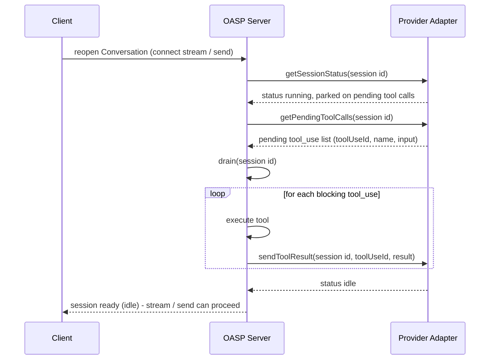

# Interactions

> Prerequisite reading: [`conversation-and-session.md`](./conversation-and-session.md).
> See also [`docs/oasp-v0-concept.md` § Interactions (v0)](../oasp-v0-concept.md#interactions-v0).

OASP v0 defines seven interactions: `publish`, `createConversation`,
`migrate`, `drain`, `stream`, `send`, and `sendToolResult`. Each
subsection below states its normative (MUST/SHOULD/MAY) behaviour, its
non-normative rationale where useful, and — briefly — whether and how
it is audited. Endpoint shapes referenced throughout are the
placeholder paths already wired into the generated OpenAPI document;
see
[`INTERACTION_PATHS`](../../packages/schemas/src/generate/interaction-paths.ts)
and [`openapi/oasp-v1alpha1.yaml`](../../openapi/oasp-v1alpha1.yaml).
This document is what turns those placeholders into full contracts.

> **Note on audit (forward reference):** Per
> [`auditEventSchema`](../../packages/schemas/src/resources/audit-event.ts),
> a conformant server emits one `AuditEvent` for **every one of these
> seven interactions**, including `stream` — which, unlike the other
> six, is a read path. That's deliberate: the FHIR `AuditEvent`
> posture this standard inherits answers "what did the agent do (or
> have observed of it) as {member} on {date}", not only "what
> changed." The full normative shape of `who` / `what` / `scope` /
> `when` / `outcome` / `refs`, and how on-behalf-of attribution works,
> is S2's scope ([#3](https://github.com/FieldstateNZ/oasp-standard/issues/3)).
> Each section below only names the `what` value it produces.

> **Note on authorization (forward reference):** every interaction
> below except `createConversation` targets an existing resource by a
> bare id; before any of the normative behaviour below runs, a server
> **MUST** authorize the resolved (authenticated, never caller-asserted)
> acting party against that resource's scope. `createConversation`
> targets no pre-existing resource, so it is authorized against its own
> caller-asserted `scope` input and the target `AgentDefinition`'s scope
> instead. The full normative treatment — the authenticated-actor trust
> boundary, exact-scope-match authorization, and the delegated-actor
> `scopePin` ceiling — is
> [`scope-and-identity.md` § The authenticated-actor trust boundary](./scope-and-identity.md#the-authenticated-actor-trust-boundary-issue-7-tranche-a).
> This document's per-interaction sections below describe each
> interaction's OWN behaviour once authorization has already passed;
> they do not repeat the authorization rule.

## `publish`

`POST /agent-definitions/{id}/publish`.

Publish moves an `AgentDefinition`'s `publishedVersion` forward to the
current draft head, without touching anything already running.

Normative behaviour:

- A server **MUST** set the target `AgentDefinition`'s
  `publishedVersion` to its current `draftVersion` at the moment
  `publish` is invoked.

  > **Note:** the concept draft says publish "snaps `published_version`
  > forward" without naming the source value explicitly. The landed
  > schema's two-pointer design leaves only one candidate:
  > `draftVersion` is "the draft head version number — every edit... 
  > advances this," and `publishedVersion` is "only advanced by the
  > explicit publish interaction" (see
  > [`agentDefinitionSchema`](../../packages/schemas/src/resources/agent-definition.ts)).
  > There is nothing else for publish to snap `publishedVersion`
  > *to*. This document makes that resolution explicit; it is called
  > out again in this slice's handback for the dev lead's sign-off.

- `publishedVersion` **MUST** be monotonically non-decreasing. A
  server **MUST NOT** implement an "unpublish" or "rollback" by
  decreasing it; such an operation, if a profile offers one, is out of
  v0 scope.
- Publish **MUST NOT** mutate any existing `Session` or `Conversation`.
  Every `Conversation` whose current `Session` is pinned to a version
  other than the new `publishedVersion` **MUST** remain exactly as it
  was — same `currentSessionId`, same `pinnedAgentVersion` — until and
  unless a later, separate `migrate` call moves it. This is the
  normative content of "live conversations are NOT disturbed."
- Publish **SHOULD** be idempotent when called again with no
  intervening draft edit (`draftVersion` unchanged): a server
  **SHOULD** treat a repeat call as a no-op rather than erroring.

> **Rationale:** Publish's entire job is to change what *new* target-version
> resolutions produce (see
> [`target-version-resolution.md`](./target-version-resolution.md))
> without touching anything already pinned. `migrate` is the only
> interaction that moves an existing Conversation onto a new version —
> publish deliberately does not cascade into one.

**Audit:** `AuditEvent{ what: 'publish', refs: { definitionId } }`.

## `createConversation`

`POST /conversations`.

Mints the **first** `Session` a brand-new `Conversation` ever rides on:
mounts `resources[]`, resolves and attaches `vaultIds[]`, and pins the
new Session's — and therefore the new Conversation's — agent version.
This is the emission point for a Conversation's *initial* credential
attachment; see [Audit](#createconversation-audit) below.

> **Note (why this is its own interaction, not folded into `migrate`):**
> credential attachment happens at Session creation
> ([`credentialSchema`](../../packages/schemas/src/resources/credential.ts)),
> and every real Conversation's *first* Session is minted here, not by
> `migrate` — `migrate` only ever mints a *replacement* Session for a
> Conversation that already exists (see its Preconditions: "the target
> `Conversation` **MUST** exist"). Before this section, initial Session
> creation had no corresponding interaction anywhere in the v0 set, so
> the first credential attachment of every Conversation was
> unauditable — not because "credential attach" was overlooked, but
> because the interaction it happens under didn't exist. Folding it
> into `migrate` was considered and rejected: `migrate` means "move an
> *existing* Conversation onto a new version," and a zero-stage
> "migration" from nothing is not that operation. Builder and
> test-session creation ([`createBuilderSession`](../../packages/conformance/src/server/setup/create-unbound-session.ts) /
> `createTestSession`) remain **unaudited setup helpers**: neither
> mints a durable `Conversation` (see
> [`conversation-and-session.md`](./conversation-and-session.md)), both
> exist purely as dev-time scaffolding to preview/validate an
> `AgentDefinition` before it is ever exposed to a real user, and
> nothing in this document's required-emission set changes that
> boundary.

### Normative behaviour

- A server **MUST** resolve the new Session's — and therefore the new
  Conversation's — `pinnedAgentVersion` to the target `AgentDefinition`'s
  current `publishedVersion`, per
  [`target-version-resolution.md`](./target-version-resolution.md#relationship-to-createconversation).
- If the target `AgentDefinition`'s `publishedVersion` is `null` (never
  published), the server **MUST reject** the `createConversation` call
  — it **MUST NOT** create a Conversation pinned to `draftVersion` as a
  fallback, and **MUST NOT** silently succeed with no Conversation
  created. This differs from `migrate`'s handling of the same
  never-published case (a successful "leave in place" no-op,
  [Preconditions](#preconditions)): `migrate`'s no-op has an existing
  Conversation to leave undisturbed, while `createConversation` has no
  Conversation yet — there is nothing to "leave in place," so rejection
  is the only sound outcome. See
  [target-version-resolution.md's `createConversation` addendum](./target-version-resolution.md#relationship-to-createconversation)
  for the full normative treatment.
- A server **MUST** mount the new Session's `resources[]` exactly as
  given by the caller — the same "in full, never partial" requirement
  [Stage 1 of `migrate`](#stage-1--mint-session-at-target-version) states
  for re-attachment applies here to first attachment.
- A server **MUST** resolve the new Session's `vaultIds[]` by matching
  each `mcp`-type tool grant requiring `auth: 'credential'` on the
  target `AgentDefinition` version against a registered `Credential`
  whose `mcpServerUrl` equals the grant's `serverUrl` — the identical
  matching rule [Stage 1 of `migrate`](#stage-1--mint-session-at-target-version)
  uses for re-resolution, applied here for the *first* time for this
  Conversation.
- Once the Session is minted, the server **MUST** create the
  Conversation with `currentSessionId` set to the new Session's `id`,
  `previousSessionIds` set to an empty array (there is no lineage yet),
  and `pinnedAgentVersion` equal to the new Session's
  `pinnedAgentVersion`.

### `createConversation` Audit

**Audit:** `AuditEvent{ what: 'createConversation', refs: {
conversationId, sessionId, credentialIds } }`. `refs.credentialIds`
names every `Credential` resolved into the new Session's `vaultIds` —
this is what makes "which credential was attached, at creation, on
whose behalf" answerable from the trail alone, closing the gap
`docs/spec/audit.md` previously tracked as v0-release-blocking (see
[`audit.md` § Credential attachment is audited](./audit.md#credential-attachment-is-audited-createconversation-and-migrate)).

## `migrate` (session upgrade)

`POST /conversations/{id}/migrate`.

This is the crown-jewel interaction: the mechanism that lets a durable
Conversation move onto a new pinned agent version without losing
continuity or requiring the end user to notice anything happened. Four
stages, executed in order, each with its own normative requirements.

### Preconditions

- The target `Conversation` **MUST** exist.
- The server **MUST** resolve a target version per
  [`target-version-resolution.md`](./target-version-resolution.md). If
  resolution yields "leave in place" (e.g. the `AgentDefinition` has
  never been published), the server **MUST NOT** perform any of the
  four stages below: `migrate` **MUST** return success as a no-op,
  never an error and never a partial attempt.
- If the resolved target version equals the Conversation's current
  `pinnedAgentVersion`, the server **SHOULD** treat `migrate` as a
  successful no-op rather than executing the four stages. Migrating a
  Conversation to the version it is already pinned to would otherwise
  mint a redundant `Session`, drain it, and append to
  `previousSessionIds` for no change — churning sessions and growing the
  lineage unboundedly under repeated calls.

### Stage 1 — Mint session at target version

- The server **MUST** create a new `Session` whose `pinnedAgentVersion`
  equals the resolved target `AgentVersionRef`.
- The new Session's `resources` **MUST** be the outgoing Session's
  `resources`, re-attached fresh at creation time (not aliased or
  carried over by reference). `Conversation` carries no `resources`
  field of its own — the mounted `file`, `memory_store`, and
  `github_repository` entries live only on the `Session` (see
  [`conversation-and-session.md`](./conversation-and-session.md)), and a
  Session's `resources` are fixed at creation and immutable thereafter —
  so the only source for the new Session's resource set is the outgoing
  Session's, re-attached at creation. A server **MUST NOT** mint the new
  Session with an empty or reduced `resources` set that silently drops
  entries the outgoing Session carried.
- The new Session's `vaultIds` **MUST** be re-resolved against the
  target version's `mcp` tool grants — each grant's `serverUrl` matched
  to a `Credential.mcpServerUrl` — rather than copied from the
  outgoing Session's `vaultIds`, since the target version's tool set
  (and therefore its credential needs) may differ from the outgoing
  version's.

### Stage 2 — Transcript-seed with a suppression marker

- The server **MUST** attempt to fetch the outgoing Session's
  transcript (its ordered [`Event`](#stream) history — e.g. via
  `listSessionEvents`) and seed it into the newly minted Session
  before any new input is accepted on it.
- Seeded content **MUST** carry a suppression marker meaning "treat as
  already exchanged": whatever the target provider needs to have this
  content in context without producing a fresh assistant turn in
  response to it. The exact transport of that marker is
  adapter-specific — out of scope for this document, see the
  forthcoming S3 adapter-contract spec
  ([#4](https://github.com/FieldstateNZ/oasp-standard/issues/4)) —
  but the semantic is normative: a freshly migrated Session
  **MUST NOT** emit a new `assistant_message_start` in response to
  seeded content alone.

#### Non-compounding transcript seeding (normative)

- Before seeding, the server **MUST** strip the suppression-marker
  structure of any earlier seed already present in the outgoing
  Session's transcript, so the content it re-seeds is flat. A
  Conversation that has migrated before carries, inside its most
  recent session's transcript, the seed block *that* migration
  produced; wrapping an already-suppressed seed block inside a new
  suppression marker — rather than stripping the old marker first —
  nests envelopes one layer deeper on every migration. A Conversation
  that has migrated *k* times would otherwise carry *k* layers of
  nested seed wrappers by its *(k+1)*-th migration, growing without
  bound.
- Stripping removes prior seed **markers**, not prior **turns**: the
  actual message/tool-call content genuinely exchanged and still carried
  in the outgoing Session's transcript **MUST** be preserved across the
  strip. The new seed for the freshly minted Session **MUST** represent
  all turns carried in the outgoing Session's transcript, marked
  suppressed exactly once — never zero times (losing content the
  outgoing Session still holds) and never more than once (nesting). This
  requirement is bounded by what the outgoing transcript actually
  contains: if an earlier `migrate` degraded to a fresh start (see the
  next rule) and thereby dropped pre-degrade history, that history is
  already gone and is not resurrected here.

### Degrade-to-fresh-start on transcript-fetch failure (normative)

- If fetching the outgoing Session's transcript fails for any reason
  (provider error, timeout, etc.), the server **MUST NOT** fail the
  `migrate` call because of it. It **MUST** instead proceed with an
  empty seed — the newly minted Session starts fresh, with no prior
  transcript context — and continue through drain and the atomic swap
  as normal.
- A server **MAY** retry the transcript fetch before giving up
  (retry policy is implementation-defined), but it **MUST** eventually
  degrade rather than block or fail `migrate` indefinitely.
- A migrate that degrades per this rule **MUST** be recorded
  distinguishably from a normal, full-seed migrate in the `AuditEvent`
  it emits: the event's `degraded` field (see
  [`audit.md`'s AuditEvent normative minimum shape](./audit.md#auditevent-normative-minimum-shape))
  **MUST** be `true` when this rule fired for that call, and **MUST**
  be omitted (never `true`) on a migrate whose transcript fetch
  succeeded. Both halves are normative: without the first, a degraded
  migrate is silent; without the second, the field is meaningless
  noise an auditor cannot trust. `outcome: 'success'` alone **MUST NOT**
  be treated as sufficient — a degraded migrate and a normal one both
  report `outcome: 'success'`, and only `degraded` tells them apart.

> **Rationale:** `migrate` exists to keep a Conversation's identity —
> its `currentSessionId`, its ability to accept new input — alive
> across a version boundary. Losing transcript continuity is a real
> degradation of user experience, but failing the migration entirely
> would be worse: it would strand the Conversation on a Session pinned
> to a version the server may be actively trying to retire.
> Availability of the Conversation's identity takes priority over
> completeness of its context.

### Stage 3 — Drain to idle

- After seeding (or after degrading to a fresh start per the rule
  above), the server **MUST** run [`drain`](#drain) against the newly
  minted Session before it is exposed as the Conversation's
  `currentSessionId`. This is one of the two points in this spec where
  `drain` **MUST** run — see
  [When drain MUST run](#when-drain-must-run).

### Stage 4 — Atomic swap + lineage append

- Once the new Session is idle, the server **MUST** update the
  Conversation atomically:
  - `currentSessionId` **MUST** be set to the new Session's `id`;
  - the outgoing Session's `id` **MUST** be appended to
    `previousSessionIds`, preserving oldest-first order (see
    [`conversation-and-session.md` § The lineage](./conversation-and-session.md#the-lineage-previoussessionids));
  - `pinnedAgentVersion` **MUST** be updated to the new Session's
    `pinnedAgentVersion`.
- "Atomic" means external observers **MUST NOT** be able to read a
  Conversation in an intermediate state — e.g. `currentSessionId`
  pointing at a Session that has not finished draining, or
  `previousSessionIds` updated without a matching `currentSessionId`
  update. A reader sees the Conversation either fully on the outgoing
  Session or fully on the new one; there is no third state.
- A server **MUST** serialize `migrate` per Conversation (e.g. a
  compare-and-set on `currentSessionId`, or an equivalent
  per-Conversation lock) so that two concurrent `migrate` calls on the
  same Conversation cannot both read the same outgoing Session and race
  the `previousSessionIds` append. A lost update there would violate the
  append-only, oldest-first lineage invariant (see
  [`conversation-and-session.md` § The lineage](./conversation-and-session.md#the-lineage-previoussessionids)).
- `migrate` **MUST NOT** delete the outgoing Session as part of the
  swap; it simply stops being anyone's `currentSessionId`. Retention
  or disposal of superseded Sessions beyond that is
  implementation-defined (see
  [`conversation-and-session.md` § The lineage](./conversation-and-session.md#the-lineage-previoussessionids)).

### Sequence diagram: publish → migrate

```mermaid
sequenceDiagram
    participant Client
    participant Server as OASP Server
    participant Def as AgentDefinition
    participant Conv as Conversation
    participant OldSess as Old Session
    participant NewSess as New Session

    Client->>Server: POST /agent-definitions/{id}/publish
    Server->>Def: set publishedVersion := draftVersion
    Def-->>Server: publishedVersion advanced
    Server-->>Client: 200 AgentDefinition (publishedVersion advanced)

    Note over Conv,OldSess: Live conversation is NOT disturbed - still pinned to its old version via currentSessionId

    Client->>Server: POST /conversations/{id}/migrate
    Server->>Server: resolve target version (real conversation -> publishedVersion)
    Server->>NewSess: mint session pinned to target version; mount resources + vaultIds
    Server->>OldSess: fetch transcript (listSessionEvents)
    OldSess-->>Server: transcript events
    Server->>Server: strip prior suppression-marker structure (non-compounding)
    Server->>NewSess: seed transcript with suppression marker (treat as already exchanged)
    Server->>NewSess: drain to idle
    NewSess-->>Server: status idle
    Server->>Conv: currentSessionId := NewSess.id; previousSessionIds += OldSess.id; pinnedAgentVersion := target version
    Server-->>Client: 200 Conversation (now riding on NewSess)
```

**Audit:** `AuditEvent{ what: 'migrate', refs: { conversationId, sessionId } }`,
emitted whether Stage 2 completed via a full transcript seed or via
the degrade-to-fresh-start path.

## `drain`

`POST /sessions/{id}/drain`.

Recovers a Session that is parked mid-turn on one or more pending tool
calls the provider is waiting on, using the Adapter contract's
`getPendingToolCalls` and `sendToolResult` operations (see
[`docs/oasp-v0-concept.md` § Adapter contract](../oasp-v0-concept.md#adapter-contract)).

### Normative behaviour

- A server **MUST** enumerate every blocking `tool_use` the Session is
  currently parked on, via the adapter's `getPendingToolCalls`.
- Before executing any enumerated blocking tool use, the server **MUST**
  authorize it against the Session's pinned `AgentDefinition` version:
  the call's tool **MUST** be present in that version's granted `tools`
  ([`agentDefinitionSchema`](../../packages/schemas/src/resources/agent-definition.ts)),
  a call reporting an MCP origin **MUST** resolve to a granted `mcp`
  tool whose `serverUrl` matches that reported origin, and — when that
  grant's `toolAllowlist` is present — the call's name **MUST** be
  included in it. For a call reporting no MCP origin, "present" means
  either an exact granted `custom` tool name match or — because OASP
  v0 does not enumerate the concrete tool names a provider's builtin
  toolsets expose (that vocabulary is provider-specific) — *any*
  granted `builtin_toolset`, which necessarily authorizes every such
  unattributed call regardless of its name: a server **MUST NOT**
  reject an unattributed call on name grounds alone while a
  `builtin_toolset` is granted, and **MUST** reject it when the
  version grants neither a matching `custom` tool nor any
  `builtin_toolset`. A server **MUST** reject (never execute) any call
  that fails this check; rejection **MUST** be surfaced as a `drain`
  failure, exactly as any other execution failure is. This
  authorization is independent of, and does not by itself satisfy, an
  `mcp` grant's `always_ask` `permissionPolicy` — that approval
  mechanism is defined by a separate authorization sub-protocol, not by
  this clause.
- For each blocking tool use, the server **MUST** execute it and
  **MUST** post its result back to the Session (via
  [`sendToolResult`](#sendtoolresult)) before considering that tool
  use resolved.
- Once every blocking tool use has a posted result, the server **MUST**
  confirm the Session has returned to `idle` status — the `status`
  [Event](#stream) with `status: 'idle'` — before `drain` returns
  success.
- If executing a blocking tool use fails, the server **MUST** surface
  this as an `error` Event rather than silently leaving the Session
  parked. An `error` Event with `recoverable: false` **MUST** cause
  `drain` to return a failure outcome rather than a false `idle`.
- Calling `drain` against a Session with no pending tool calls (already
  `idle`) **SHOULD** be treated as a no-op success rather than an
  error — `drain` **SHOULD** be idempotent.

### When drain MUST run

`drain` **MUST** run in at least these two circumstances:

1. **On reopen** — when a client reconnects to or reopens a
   Conversation whose current Session's status indicates it is parked
   on pending tool calls (e.g. a dropped connection interrupted a
   tool-execution round-trip), the server **MUST** drain that Session
   before serving new [`stream`](#stream) or [`send`](#send) traffic
   against it.
2. **Post-seed during `migrate`** — as
   [Stage 3](#stage-3--drain-to-idle) of `migrate`, immediately after
   transcript-seeding (or degrading to a fresh start on) a newly minted
   Session and before the atomic swap, the server **MUST** drain that
   Session to idle.

A server **MAY** also expose `drain` as a directly client-triggered
recovery action outside those two cases; the standard does not require
it to be an internal-only subroutine.

### Sequence diagram: drain-on-reopen



**Audit:** `AuditEvent{ what: 'drain', refs: { sessionId } }`.

## `stream`

`GET /sessions/{id}/events` (SSE).

### Normative behaviour

- A server **MUST** transport the normalised
  [`Event`](../../packages/schemas/src/resources/event.ts) vocabulary
  — `assistant_message_start` / `assistant_message_text` /
  `assistant_message_end`, `assistant_thinking`, `custom_tool_use`,
  `builtin_tool_use`, `status`, `error` — over Server-Sent Events as
  the first-class transport for a running Session.
- A conformant adapter **MUST** preserve the order in which the
  underlying provider emitted the corresponding native events. Each
  Event's `id` **MUST** be assigned so that it is monotonically
  **lexicographically** increasing in emission order within a Session —
  i.e. sorting the ids as byte strings reproduces true emission order.
  (A bare ascending integer rendered without zero-padding does **not**
  satisfy this — `"10"` sorts before `"2"` — so an `id` that encodes a
  counter **MUST** be zero-padded, or otherwise constructed to be
  lexicographically monotonic; `listSessionEvents` pagination relies on
  this.) This is the ordering guarantee the Adapter contract calls out —
  translation into the normalised vocabulary is lossy by design, but
  event ordering is not something a conformant adapter may lose.
- The stream **MUST** terminate when a `status` Event with
  `status: 'idle'` is emitted, or when an `error` Event with
  `recoverable: false` is emitted. It **MUST NOT** terminate merely
  because assistant output has momentarily paused while `status`
  remains `'running'` (e.g. mid tool-execution).
- The stream **MAY** remain open across a `recoverable: true` `error`
  Event, since the Session can still be brought back to idle
  (typically via [`drain`](#drain)).
- `listSessionEvents` **MUST** be able to reconstruct the same ordered
  event history for any Session, paginated using each Event's `id` as
  the cursor — it is both the derive-on-read fallback for clients that
  never streamed live and the audit source. A client that loses its
  SSE connection **SHOULD** resume by paginating `listSessionEvents`
  from the last `id` it received, rather than assuming transparent
  stream resumption at the transport level.

**Audit:** `AuditEvent{ what: 'stream', refs: { sessionId } }`. Unlike
the other five interactions, `stream` is a read path; see the
[audit forward-reference note](#interactions) above for why it is
still audited.

## `send` / `sendToolResult`

`POST /sessions/{id}/messages` and `POST /sessions/{id}/tool-results`.

### `send`

- A server **MUST** post the given message content into the target
  Session as a new turn attributed to the calling principal.
- `send` targets a specific Session by `id`, not a Conversation
  directly. For a Session that belongs to a `Conversation` — i.e. it is
  that Conversation's `currentSessionId` or appears in its
  `previousSessionIds` — a server **MUST** reject the `send` unless the
  target Session's `id` equals the Conversation's `currentSessionId`. A
  Session that has been superseded by `migrate` (and so appears only in
  `previousSessionIds`) **MUST NOT** accept new `send` traffic. Builder
  and test-session Sessions (see
  [`target-version-resolution.md`](./target-version-resolution.md)) are
  not bound to a `Conversation` and so are not subject to this
  current-session check.

  > **Note:** neither the concept draft nor the S0 schemas spell this
  > restriction out explicitly; it is inferred here from the
  > Conversation/Session pinning model — a superseded Session is
  > disposable substrate, and admitting new input to it after
  > `migrate` has moved the Conversation on would silently fork the
  > single thread this whole model exists to prevent. It is scoped to
  > Sessions that actually belong to a Conversation so it cannot reject
  > legitimate builder/test-session traffic, which has no
  > `currentSessionId` to match. Flagged for the dev lead's sign-off.

### `sendToolResult`

- A server **MUST** correlate the posted result to a specific pending
  tool use via `toolUseId`, matching the `toolUseId` on the
  `custom_tool_use` Event it answers.
- A server **MUST** reject a `sendToolResult` call whose `toolUseId`
  does not correspond to a currently pending tool use on that Session
  — there is nothing to post the result against.
- `sendToolResult` is the same primitive [`drain`](#drain) uses
  internally to post results for blocking tool uses. A client posting
  a tool result directly, and `drain` posting one on a client's
  behalf, are the same operation from the server's point of view.

**Audit:** `AuditEvent{ what: 'send', refs: { sessionId } }` and
`AuditEvent{ what: 'sendToolResult', refs: { sessionId } }`
respectively.
